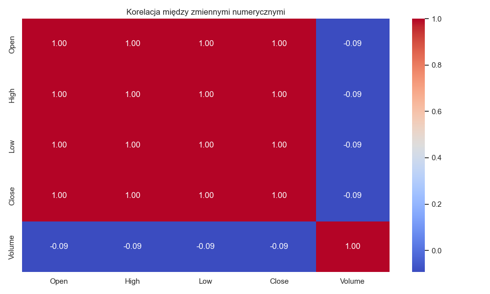
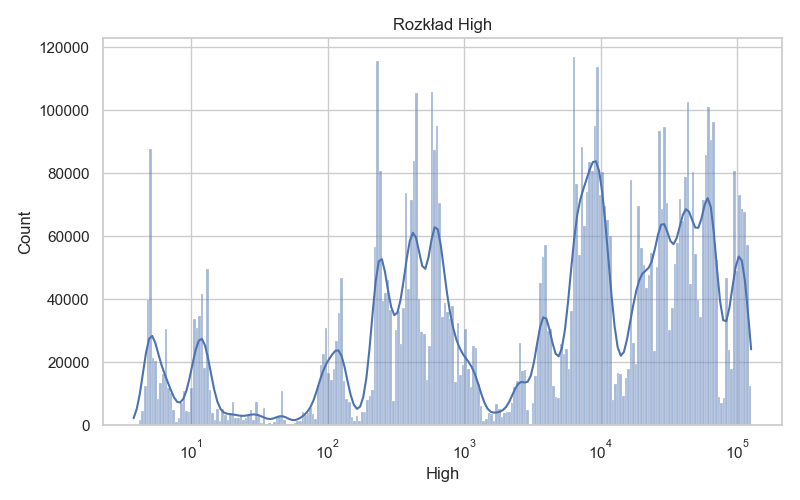
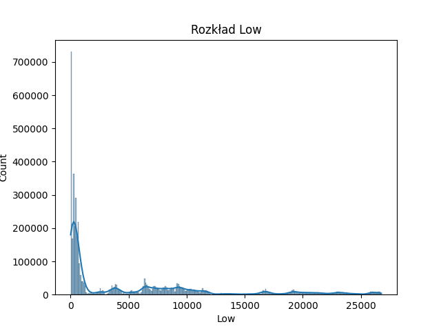
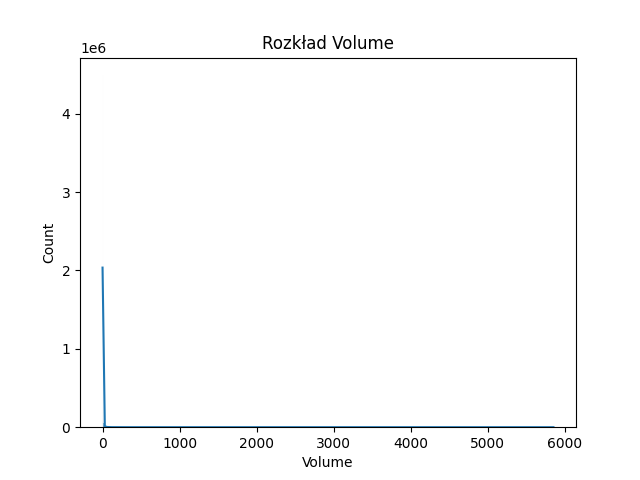

# 🧠 Raport EDA — Analiza danych BTC

- !Historia ceny Bitcoina [close_trend.png](close_trend.png)

## 1. Opis danych

Dane pochodzą z pliku `btc-price-history.zip` i zawierają historyczne notowania Bitcoina.  
Zbiór danych obejmuje m.in. kolumny:

| Kolumna     | Opis |
|--------------|------|
| **Timestamp** | Znacznik czasu (sekundy lub data) określający moment notowania |
| **Open** | Cena otwarcia w danym przedziale czasowym |
| **High** | Najwyższa cena w danym okresie |
| **Low** | Najniższa cena w danym okresie |
| **Close** | Cena zamknięcia w danym okresie |
| **Volume** | Wolumen transakcji w danym okresie |

Po wczytaniu danych i konwersji kolumny `Timestamp` do formatu daty, możliwa była analiza trendu cenowego oraz relacji między zmiennymi.

---

## 2. Główne obserwacje

- 📈 **Ceny (Open, High, Low, Close)** są silnie ze sobą skorelowane (współczynniki bliskie **1.0**).  
  To oczekiwane zachowanie — wszystkie opisują ten sam rynek w tym samym czasie.

- 💰 **Volume (wolumen)** ma **słabą lub ujemną korelację** z cenami.  
  Sugeruje to, że duży obrót nie zawsze oznacza wzrost ceny — mogą to być zarówno zakupy, jak i sprzedaże.

- 🕓 **Rozkłady cen (Open, Close, itp.)** są **mocno skośne**, z długim ogonem w prawo.  
  Oznacza to, że większość wartości skupia się w niższych zakresach, ale występują pojedyncze okresy bardzo wysokich cen.

- ⏱️ **Trend czasowy** pokazuje długoterminowy wzrost ceny Bitcoina z wyraźnymi okresami spadków i konsolidacji.

---

## 3. Propozycje dalszych kroków

### 🔧 Czyszczenie danych
- Sprawdzić brakujące wartości (`NaN`) i ewentualnie uzupełnić lub usunąć.  
- Zweryfikować poprawność formatu kolumny `Timestamp`.  
- Usunąć lub przeskalować ekstremalne wartości (outliers).

### ⚙️ Standaryzacja i przygotowanie
- Przeskalować zmienne cenowe (np. standaryzacja Z-score lub MinMax).  
- Dodać kolumny pomocnicze: np. zmiana procentowa (`pct_change()`), średnie kroczące, wskaźniki techniczne (EMA, RSI).

### 🧩 Feature Engineering
- Ekstrakcja cech czasowych: dzień tygodnia, miesiąc, pora dnia.  
- Wykorzystanie różnic cenowych (`Close - Open`) jako wskaźnika dziennego trendu.  
- Grupowanie danych w większe interwały (np. 1h, 1d) w celu wygładzenia szumu.

---

## 4. Następne kroki w projekcie

- Przygotować pipeline `data_cleaning` w Kedro, który:
  - wczytuje dane z `raw_data`,
  - czyści i konwertuje dane,
  - zapisuje wynik do `data/processed/clean_btc_data.csv`.

- Następnie można stworzyć pipeline `modeling`, który będzie:
  - przygotowywać cechy wejściowe (`features`),
  - trenować model predykcyjny ceny `Close`.

---

📊 **Pliki wygenerowane w analizie:**

- **Heatmapa korelacji:**  
  

- **Rozkład Close:**  
  

- **Rozkład High:**  
  

- **Rozkład Low:**  
  

- **Rozkład Open:**  
  

- **Rozkład Volume:**  
  
