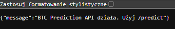
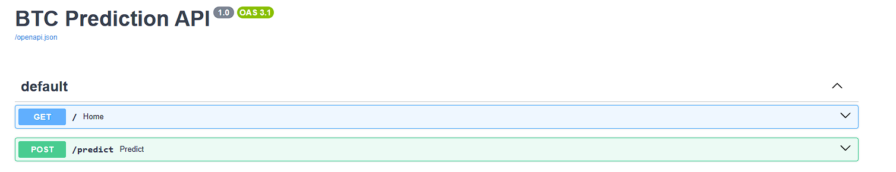
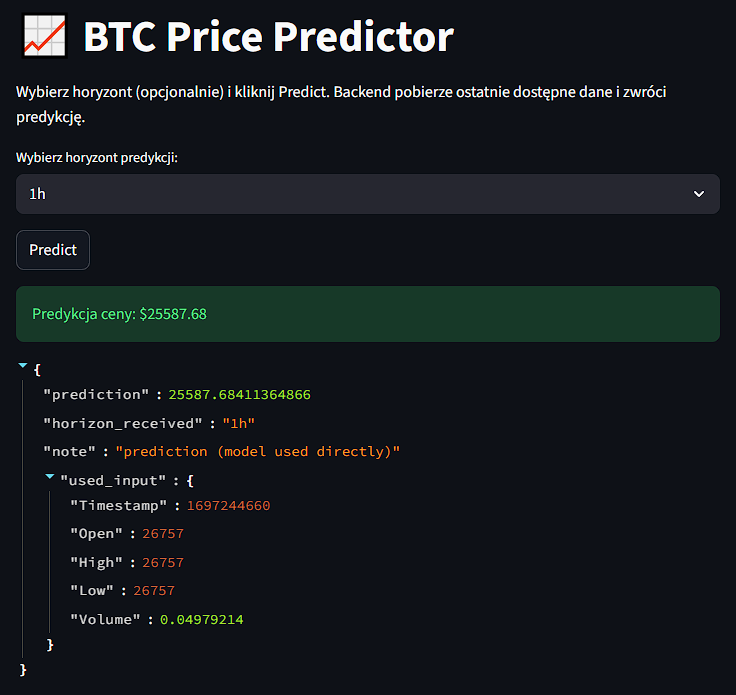
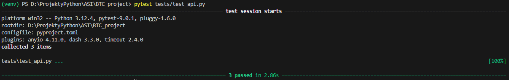

# Raport projektu: BTC Price Predictor

## 1. Cel projektu

Celem projektu było stworzenie aplikacji webowej umożliwiającej interakcję z wytrenowanym modelem uczenia maszynowego przewidującym cenę Bitcoina. Aplikacja składa się z backendu (API) oraz frontendu (interfejs użytkownika), co pozwala na przesyłanie danych wejściowych i otrzymywanie predykcji w czasie rzeczywistym.

Rezultatem jest działająca aplikacja webowa uruchomiona lokalnie, w której backend i frontend współpracują ze sobą.

---

## 2. Architektura aplikacji

### Backend (API)

Backend został zaimplementowany przy użyciu FastAPI w pliku `app/main.py`. Główne funkcjonalności:

- Wczytywanie wytrenowanego modelu z pliku `best_model.pkl` znajdującego się w katalogu `data/reporting/`
- Przyjmowanie danych wejściowych w formacie JSON
- Zwracanie wyników predykcji w formacie JSON

Endpointy:

- `GET /` - endpoint testowy zwracający komunikat o działaniu API
- `POST /predict` - endpoint przyjmujący dane wejściowe i zwracający predykcję modelu

Poprawna odpowiedź z endpointu głównego:
```json
{
  "message": "BTC Prediction API działa. Użyj /predict"
}
```

- **Zrzut ekranu odpowiedzi:** 
  

- **Zrzut ekranu odpowiedzi z /docs:** 
  


### Frontend

Frontend został zrealizowany w Streamlit w pliku `frontend/app.py`. Funkcjonalności:

- Interfejs do wprowadzania parametrów predykcji, w tym opcjonalnego horyzontu czasowego
- Przesyłanie danych do backendu przez zapytania HTTP POST do endpointu `/predict`
- Wyświetlanie otrzymanej predykcji w czytelnej formie

Przykładowy wynik predykcji wyświetlany w interfejsie:
```
Predykcja ceny: $25587.68
```

Szczegółowa odpowiedź z backendu zawiera dodatkowe informacje:
```json
{
  "prediction": 25587.68411364866,
  "horizon_received": null,
  "note": "prediction (model used directly)",
  "used_input": {
    "Timestamp": 1697244660,
    "Open": 26757,
    "High": 26757,
    "Low": 26757,
    "Volume": 0.04979214
  }
}
```

- **Zrzut ekranu strony:** 
  

---

## 3. Testy integracyjne

W projekcie przygotowano testy integracyjne w pliku `tests/test_api.py` przy użyciu `pytest` oraz `TestClient` z FastAPI. Testy weryfikują:

- Poprawne działanie endpointu głównego `/` i zwracanie odpowiedniego komunikatu
- Poprawne działanie endpointu `/predict` dla danych testowych
- Poprawność struktury zwracanych danych JSON

Wynik uruchomienia testów:

- **Zrzut ekranu terminala:** 
  


## 4. Uwagi dotyczące modelu

Obecnie użyty model jest wstępnym rozwiązaniem i wymaga ponownego trenowania na zbiorze danych historycznych Bitcoina. W raporcie odnotowuję następujące kwestie:

- Model znajdujący się w pliku `best_model.pkl` został wykorzystany do demonstracji działania aplikacji i integracji frontendu z backendem
- Predykcje generowane przez model są bardzo niedokładne i wymagają poprawy przed dokończeniem projektu
- W przyszłych iteracjach planowane jest ponowne trenowanie modelu na szerszym zakresie danych oraz ewentualne zastosowanie bardziej zaawansowanych technik modelowania

---

## 5. Instrukcja uruchomienia

### Uruchomienie backendu
```bash
uvicorn app.main:app --reload
```

Po uruchomieniu dostępna jest automatycznie generowana dokumentacja API pod adresem: `http://localhost:8000/docs`

### Uruchomienie frontendu
```bash
streamlit run frontend/app.py
```

Interfejs użytkownika dostępny jest pod adresem: `http://localhost:8501`

### Uruchomienie testów
```bash
pytest tests/test_api.py
```

---


## Podsumowanie

Projekt został zrealizowany zgodnie z wymaganiami. Stworzono działającą aplikację webową składającą się z backendu opartego na FastAPI oraz frontendu zrealizowanego w Streamlit. Oba komponenty współpracują ze sobą poprawnie, co zostało potwierdzone testami integracyjnymi. Model wymaga dalszej pracy w zakresie jakości predykcji, jednak infrastruktura aplikacji jest gotowa do dalszego rozwoju.